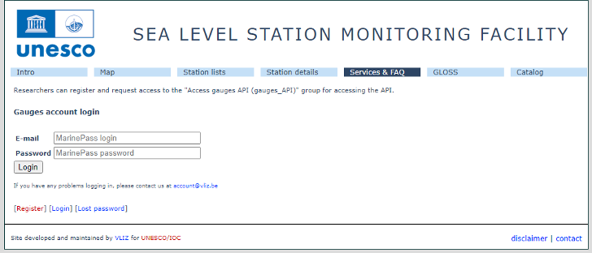
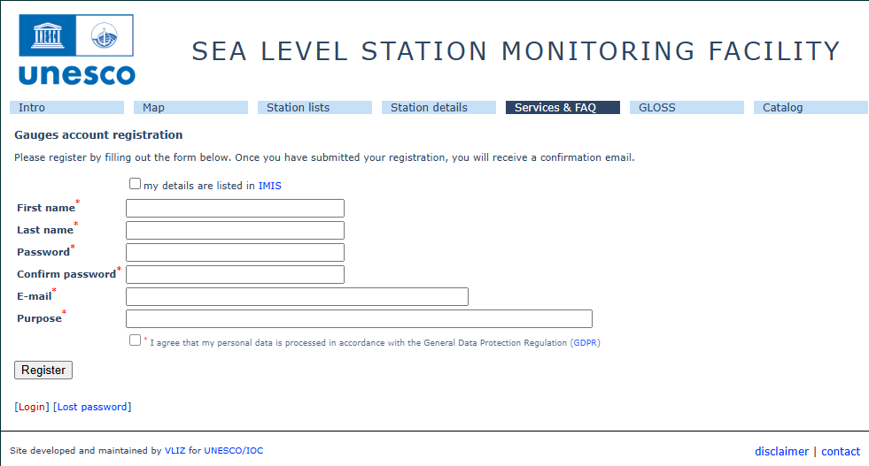
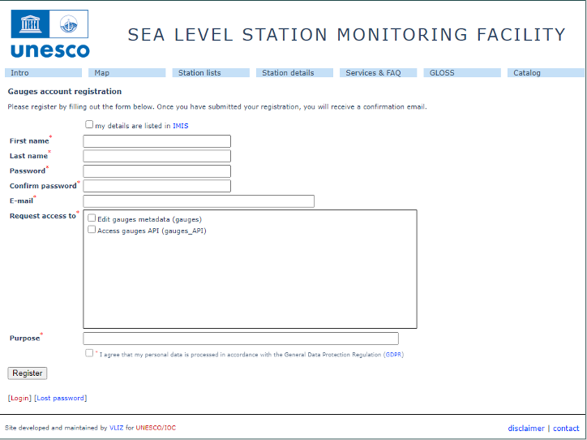
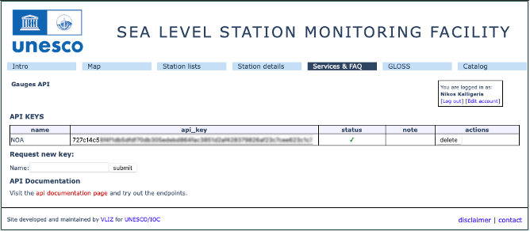
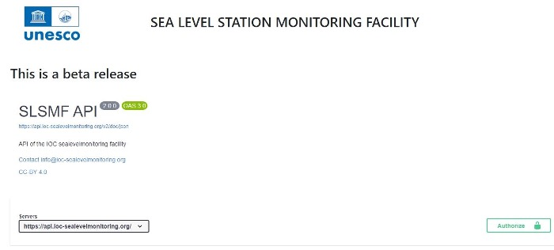
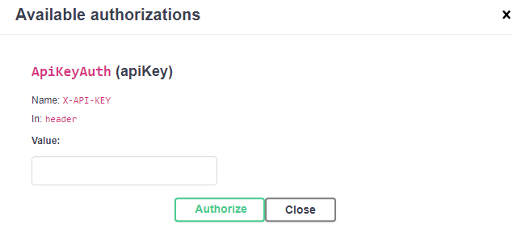
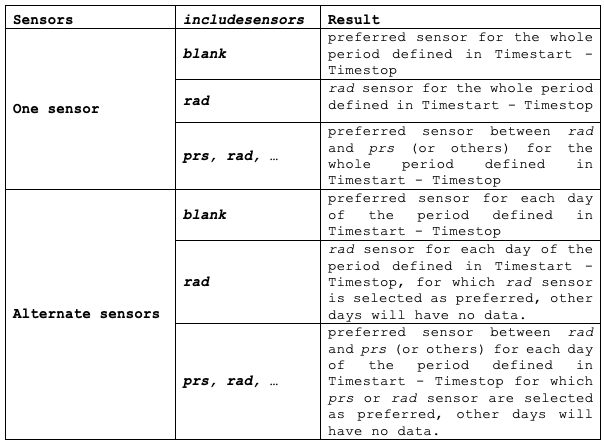

## Introduction

The aim of this manual is to provide a comprehensive explanation of the features and capabilities of the API service provided through the SLSMF portal. This API service allows users to access and interact with quality-controlled sea level research data, specifically related to sea level measurements and analyses used for quality control purposes. The manual will guide users through the functionality of the API, detailing how to retrieve, process, and utilize the available data for research and analysis in the field of sea level monitoring.

## Accessing the SLSMF API web-service

### Request API key

This API key provides access to sea-level monitoring data. To request API keys needed for version 2 of this API, visit the [SLSMF API page](https://ioc-sealevelmonitoring.org/api.php).

If you don't have an account, you will need to register for an account, by clicking on Register.

If you already have an account insert your credentials to Login. 

In the <ins>Request access to</ins> box, check <ins>Access gauges API (gauges_API)</ins>. After approval from the administrators, an email will be sent.

Once the registration process is successfully completed, you can proceed to request an API key by visiting this [link](https://www.ioc-sealevelmonitoring.org/api.php).

You will first need to assign a name to the API key, and then click the "Submit" button to create it. After submission, the API key will appear in the table, where you can easily copy and paste it for use in your applications.

Additionally, you have the option to request multiple API keys, depending on the specific requirements of your organization. This allows you to integrate with various services as needed.

### Authorize

After obtaining the API KEY, you need to follow an authorization procedure. In the [SLSMF API documentation portal](https://api.ioc-sealevelmonitoring.org/v2/doc), click on "Authorize". Enter the API KEY in the Value field and then click "Authorize".

A message confirming the API KEY is authorized will appear, and the window must be closed. To access research-quality controlled data from the SLSMF service, the API KEY should be included as a header
(X-API-KEY) in any request submitted.

## API endpoints description

### research

Code \[*string*\]

The station code referenced in the query corresponds to the IOC code listed in the Sealevel Station Catalog ([SSC](http://www.ioc-sealevelmonitoring.org/ssc/)). This catalog provides unique identifiers for each station. Upon retrieving data from the database the corresponding catalog code will be used, to allow you to retrieve the best possible data for a specific station.

Sensor \[*string*\]

**One sensor**: This option will return data from a single sensor type for the **entire specified period**. When the *includesensors* field is left empty the sensor chosen will be the one that was set as preferred for most of the days during the requested time frame. But if sensors are added to the *includesensors* field, the sensor with the highest number of preferred days from this selection will be returned. Thus when only one sensor is added to the *includesensors*, data will be returned for that sensor.

For a physical station (Catalog Id), the preferred sensor is the one selected with the best performance for a given time frame after the fast QC.

**Alternate sensor**: This option returns data from multiple sensors, **different per day**. The preferred sensor for each individual day will be returned, if there are no selected sensors in the *includesensors* field. But when sensors are added to the *includesensors* field, the sensors in the result will be filtered by this selection.

If no preferred sensor is available on a given day, no data will be returned for that day.

The following examples illustrate the functionality of this parameter, in combination with the values given in the *includesensors* parameter:

Days per page \[*Integer*\]

Maximum number of days included in a page (i.e. a single file to download) (max 3650 days).

Page \[*Integer*\]

If the data is distributed across multiple pages (files), this field specifies the particular page (file) that should be downloaded. For example, if the data is divided into a series of three pages, you would need to first request page 1, then page 2, and finally page 3 to download the entire dataset.

In the header of the file the following info is provided for the paging of the data. The example is from the second page of a 3-pages set, for a 30 days period, with 10 days per page.

  -----------------------------------------------------------------------
| total\_days | current\_page | total\_pages | next\_page | prev\_page | start |
| :--- | :--- | :--- | :--- | :--- | :--- | 
| 30 | 2 | 3 | 2 | 1 | Time of request |
  -----------------------------------------------------------------------
  
Timestart \[*string*\]

The starting date is the beginning of the time period for which data is being requested, marking the initial date of the desired data range (this date is included in the results).

Timestop \[*string*\]

The ending date is the last date of the time period for which data is being requested, marking the final date in the specified data range (this date is not included in the results). When the Timestop equals the current date, real time data will be added for the current day. The data will be from the sensor which was selected the most as preferred during the whole period, taking the include sensors field into account.

Includesensors \[*multiple stings*\]

The data provided will be from the selected sensor, if only one sensor is specified. Alternatively, it will be sourced from the preferred sensors listed in this field.

Available types:

  -----------------------------------------------------------------------
| Sensor code | Description |
| :----- | :-------- |
| *prs* | pressure |
| *pr1* | 1st pressure |
| *pr2* | 2nd pressure |
| *pr3* | 3rd pressure |
| *rad* | radar |
| *ra2* | 2nd radar //acoustic or microwave |
| *ra3* | 3rd radar |
| *ras* | radar in stilling well |
| *enc* | float sensor with encoder |
| *enb* | 2nd encoder type |
| *en2* | 2nd encoder type |
| *aqu* | Aquatrak (brand) |
| *bub* | bubbler |
| *bub1*| 1st bubbler |
| *prd* | predicted tide |
| *ecs* | acoustic echo sounder |
| *ec2* | 2nd acoustic echo sounder |
| *wls* | water level sensor |
| *pwl* | primary water level |
| *bwl* | backup water level |
| *flt* | float |
| *stp* | Etrometa step gauges |
| *sw1* | 1st switch |
| *sw2* | 2nd switch |
| *bat* | battery - not available in research data |
| *atm* | atmospheric pressure |
| *prt* | pressure tsunami - dart |
| *prte*| pressure tsunami event - dart - Always added to prt sensor if available |
  -----------------------------------------------------------------------

Also, check the interaction between Sensors and Includesensors option, described under Sensors.

level data \[*Boolean*\]

Options: true / false. The requested data will be recalculated in reference to the mean sea level of the last 30 days. Enabling this option (setting it to "True") is highly recommended when requesting
data from alternate sensors. This ensures consistency and prevents discrepancies or shifts in the data, when transitioning between different sensors.

original\_stime \[*Boolean*\]

Options: true / false.

(True) Obtain the data at the specific rate or frequency defined by the station. This means that the data will be provided according to the station's predefined sampling rates.

(False) Organize the data into predefined time slots based on the transmission rate, essentially normalizing the data to ensure it aligns with the established intervals. This process adjusts the data to fit consistent, standardized time periods, ensuring that it is uniformly distributed according to the rate at which it was transmitted or recorded.

**Quality control filters**

filter\_out\_of\_range \[*Boolean*\]

Options: true / false. This filter eliminates data points that are significantly higher or lower than the majority of the values within a specified time period. It is designed to identify and remove outliers or anomalies, ensuring that the remaining data more accurately represents typical trends and patterns for that particular time frame.

filter\_exceeded\_neighbours \[*Boolean*\]

Options: true / false. This filter works by comparing the difference between adjacent sea level data points. If the difference between a specific data point and its neighboring values exceeds a defined
threshold, that data point is removed. This helps eliminate abrupt, unusual fluctuations that may not align with the general trend of the surrounding data. Caution should be exercised when using this filter for tsunami events, as the initial tsunami signal may be incorrectly identified as an outlier due to exceeding the neighboring data points.

filter\_spikes\_via\_median \[*Boolean*\]

Options: true / false. This filter removes data points that deviate substantially from a spline-fit curve, which is a smooth, flexible curve that models the underlying trend of the data. By identifying and removing points that significantly differ from this curve, the filter helps to retain only those data points that are consistent with the overall trend, improving the accuracy and reliability of the dataset.

filter\_flat\_line \[*Boolean*\]

Options: true / false. This filter addresses data gaps that appear as flat, unchanging segments in the data diagrams, typically indicating periods where no data was recorded or the data was unavailable. By removing these flat-line sections, the filter helps to clean the dataset, ensuring that only continuous, meaningful data is retained for analysis and that gaps in the data do not distort the overall trends or patterns.

Media type \[*text/csv - application/json*\]

In this section, you have the option to choose the format in which you would like the requested data to be delivered. The dropdown menu provides two available choices: you can either receive the data in text format, where values are separated by commas, or in JSON format, which is a structured data format commonly used for representing information in key-value pairs.

More details about the function of the QC filters can be found in the [QC\_steps\_description](research_data/) file.

**<ins>Future work</ins>: description of all available endpoints, i.e. station, sensor, operator and catalog.**
