## Table of Contents

> [Outline of SLSMF sea level data streaming](#outline-of-slsmf-sea-level-data-streaming)
>
> [Orchestration](#orchestration)
>
> [SLSMF data retrieval](#slsmf-data-retrieval)
>
> [Fast QC calculations](#fast-qc-calculations)
>
> [Preferred Sensor](#preferred-sensor)
>
> [Slow QC calculations](#slow-qc-calculations)
>
> [API](#api)
>
> [QC steps](#qc-steps)
>
> [Completeness](#completeness)
>
> [Distinctness](#distinctness)
>
> [Flatlines](#flatlines)
>
> [Out of range](#out-of-range)
>
> [Shift detection](#shift-detection)
>
> [Exceeding neighbours](#exceeding-neighbours)
>
> [Spikes via median](#spikes-via-median)

## Outline of SLSMF sea level data streaming

The sea level data streaming script is designed to transfer data from the MSSQL Gauges database to a MongoDB. The data are streamlined in such a way that the users are able to retrieve a unified data stream representing a physical station, which may have multiple sensors, each with a different SLSMF station code. To achieve this, the data is not grouped by the station code of the SLSMF, as it is unique for a station and its manner of retrieval/receival. Instead, the
[SSC](http://www.ioc-sealevelmonitoring.org/ssc/)
(catalog) identifier is used, which groups all SLSMF station codes to a unique identifier for a physical station. For a single SSC-identifier a single sensor is selected from all linked sensors (or SLSMF stations) as the best performing or the preferred sensor for that day. The user is able to select *one-sensor* or *alternate-sensors* from the API. The *one-sensor* option returns data for the most preferred sensor in the period requested, so only one sensor type is returned. The *alternate-sensors* option returns the preferred sensors stitched one after the other, meaning the sensor can change in the result.

### Orchestration

Retrieval from SLSMF, selection of preferred sensor and QC calculations. An overview of the SLSMF QC data flow and its main/individual components is provided in Fig. 1-2. For an overview of all arguments use \--help.

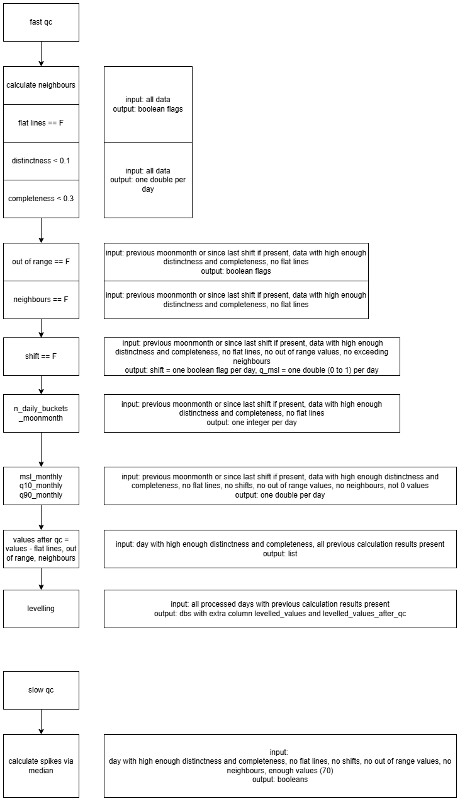

**Figure 1**. The SLSMF QC data flow in simple steps shown on the left column and input/output data are shown on the right column.

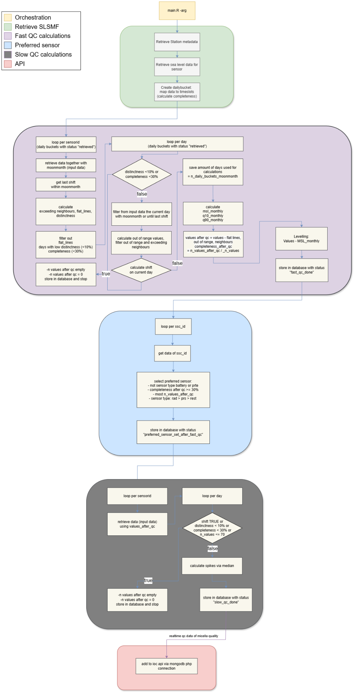

**Figure 2**. The main/individual components of the SLSMF QC data flow.

### SLSMF data retrieval

A combination of station, sensor metadata and catalog values are stored as a rich metadata collection in MongoDB. Besides the metadata, also the sea level data from the SLSMF using its API is retrieved. Several manipulations are done to provide a lightweight daily bucket. The sea level measurements are ordered in a list where each position defines the time at which it was measured. The time of the first element in the array is calculated relative to midnight using the offset stored in the bucket. For the other values, their position in the list is used in combination with the rate of the sensor to calculate their time of measurement. Not all sensors strictly adhere to the rate at which they operate, meaning that an exact match to a timeslot in the array is not guaranteed. Therefore, the values are fit using a rounding down of the exact time, down to the granularity of the sensor rate. The data is then fit to the timeslots and the difference is stored together with the correct value in a separate field. This means that one can obtain the values on the expected retrieval time or the time of actual retrieval. Some data can be lost at this point as multiple values can be fitted to the same bucket, in which case the average of the time and value are computed.

It is aimed for every bucket to be calculated once, as measurements in the SLSMF are never updated. A prefix is added to the fields to reflect them in the document as retrieved through this system and to flag them as protected, indicating that no mutations/transformations should be done to these fields after initial loading. This process provides the capability to recalculate all coming operations without reloading data.

Because the API of the SLSMF has a 30-day (or 150,000 values) limit, the necessary steps are followed to provide data for larger periods or sensors with a higher than 1 minute frequency. For the latter, a smaller than 30-day window needs to be used that facilitates initial or bulk loading of daily buckets. When the script is run for a specific SLMSF station, an extrapolation will happen to all sensors linked to the same SSC-id to make sure later steps will always be calculated on all available data for a physical station.

#### Steps

-   Metadata for station-sensor - aggregation of three endpoints:

    -   stationlist, sensorlist, ssc-catalog;

-   Retrieve sensor sea level data for a period:

    -   Calculate data step for API (smaller for high frequency stations);

    -   Using API, max 30-day data steps at once (loop);

-   Daily bucket creation:

    -   All prefixed fields in the document are filled-in at this point - meant to be retained and untouched during the whole life of the document;

    -   Store original record count in SLSMF;

    -   Store record count of values stored in current bucket;

    -   Transform sea level data to array using timeslots:

        -   Calculate the offset for that day (seconds until first value);

        -   Round down the time to the granularity of the sensor rate;

        -   Add to value array if more than one value available for a timeslot and calculate average.

        -   Calculate difference between rounded down value and actual value and store in value offset array.

    -   Calculate completeness: number of values in a day divided by the expected number of values in a day based on sample rate.

-   Set status of buckets to be retrieved.

### Fast QC calculations

The fast quality-control is calculated for every sensor within the current day and the previous moon-month. The moon-month period is calculated by getting the previous date at which the moon phase was at the same position as the day that is being parsed. Data is retrieved for the moon-month and is used to calculate several QC steps described in this manual, namely distinctness and shift detection, out of range, exceeding neighbours and flatline. If there was a shift between the previous moon-month and the current day, only the data since the shift is used. In the end, a new values array that has been filtered with all QC parameters is provided.

### Preferred Sensor

For a physical station (Catalog Id), one sensor is selected with the best performance for a given day after the fast QC.

The preferred sensor per catalog\_id is selected based on a few criteria
in the following order:

-   Sensor type *battery* or *prte* cannot be preferred;

-   Completeness after QC \>= 30% (completeness after QC = *n\_values* / *n\_expected_values*);

-   Distinctness after QC \>= 10% (distinctness after QC = *n\_unique_values* / *n\_values*);

-   Most *n\_values\_after_qc* (considered good values, namely raw values without out of range, exceeding neighbours, flat_lines,
    (*spikes\_via\_median*));

-   If multiple sensors pass the aforementioned checks, a predefined preference order for sensor types is applied as follows: *rad* \> *ra2* \> *ra3* \> *prs* \> *pr1* \> *pr2* \> *rest*;

### Slow QC calculations

The slow quality control is for more computationally-demanding calculations, currently only used for curve fitting to detect spikes.

### API

The API will return the preferred sensor data for a given period for a specific station. The user can enter the SLSMF gauges codes, but will receive data on a specific SSC Catalog id, as this represents a physical station. For every measurement, the user obtains the time, level and sensor type. Be advised that the sensor type does not uniquely identify the sensor and its data stream. Within the SLSMF system, that same rad filter for a station can come from GTS, web service or any other stream. In the future pre-calculated data streams will also be available.

## QC steps

Steps involved in the QC process:

-   Completeness

    -   Number of values in a day VS expected number of values for that day based on sample rate.

    -   Cutoff: 30%

-   Distinctness

    -   Number of distinct values VS number of values in a day.

    -   Cutoff: 10%

-   Flatline 
    A repeat of X number of values.

    -   Value is at least 40 times present;

    -   Sequence is 40 values long;

    -   A number of 2 different values can be between two consecutive values and still be considered a sequence.

-   Out of range

    -   Tolerance is calculated as: 3\*abs(percentile90 - median).

-   Shift detection

    -   A shift is detected in data when the average of the day is as high or as low as the 90th or 10th quantile, respectively, based on prior sea level data (either for moon-month or to the previous detected shift).

    -   The days with shift are not returned in the dataset.

    -   When the mean sea level is calculated for the levelling of data, the data of the last moon month will be used or until a shift date is reached. Resulting in nicely aligned levelled data.

-   Exceeding neighbour

    -   A max allowed difference between two data points.

    -   Detect blunt spikes by marking points between exceeding neighbours.

    -   Iterate over all groups of exceeding neighbours and unmark using local median and group size.

    -   The start and end of gaps are not marked as exceeding neighbours.

-   Spikes via median

    -   Spline-fitting to detect spikes exceeding fitted curves using the scaled median absolute and standard deviations.

### Completeness

**Input data**

Function receives all sea level data of chosen time period (default is previous day).

**Parameters**

None.

**Calculations**

Number of values for a day / number of values for that day based on sample rate.

**Steps**

-   Group data per day;

-   *Completeness* = count the number of values and divide by the expected number of values in a day (60 \* 60 \* 24 / sample rate).

**Outputs**

-   One value, percentage as decimal. E.g., 0.2.

### 

### Distinctness

**Input data**

Function receives all sea level data of chosen time period (default is previous day) plus previous moon-month.

**Parameters**

None.

**Calculations**

Number of distinct values for a day / number of values for that day.

**Steps**

-   Group data per day;

-   *Distinctness* = count the number of unique values and divide by the
    number of values in a day.

**Outputs**

-   One value, percentage as decimal. E.g., 0.2.

**Example**

Example provided for the radar (*rad*) sensor of the Diego Garcia tide gauge station (SSC-garc) in January of year 2023 - see Fig. 3-4 and example folder named "garc". The sea level data for the first nine days of the month include flatlines that are partially detected by the flatlines algorithm (blue dots in Fig. 3). Regardless of the partial flatlines detection, the data for the first nine days were discarded either due to shifts or low distinctness (distinctness below the 10% threshold) - note that the distinctness check is performed prior to the application of the flatlines algorithm. The quality-controlled sea level data start from January 11th, 2023, due to a shift being detected on January 10th after the flatline ends, and the data for that day being discarded (Fig. 4).

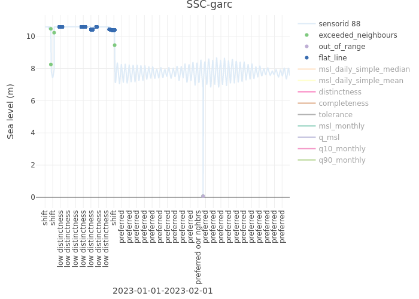
 
**Figure 3.** Distinctness example presented through sea level data of the *rad* sensor of the SSC-garc station for January 2023; the labels at the bottom of the chart flag whether a low distinctness or shift is detected within a day, and/or the days for which the sensor is preferred compared to the other available sensors of the particular station, if any.

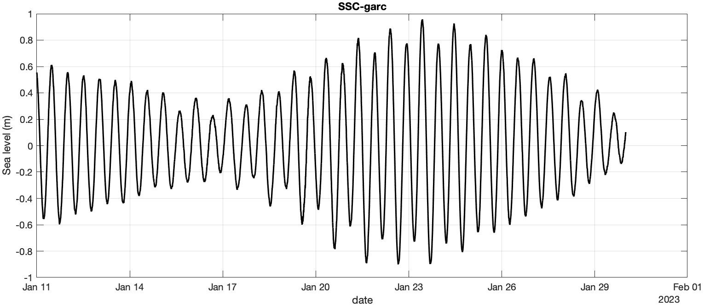

**Figure 4.** Distinctness example presented through sea level data of the *rad* sensor of the SSC-garc station for January 2023: relative sea level data after QC.

### **Flatlines**

**Input data**

Function receives all sea level data for 1 day.

**Parameters**

-   *min\_value\_frequency*: minimum number of times a value has to be present in a day before it is considered a possible flat line - value set at 40.

-   *sample\_rate*: the min_value_frequency can be adjusted based on the sample rate. If sample rate is high, the *min\_value\_frequency* can be set higher or vice versa.

-   *max\_gap\_size*: maximum gap size that consecutive values can contain. If it's 0, then a flat line can't have gaps in itself. For a value of 1, a gap size of 1 is allowed, before it's considered as two separate flat lines - value set at 2.

-   *min\_flat\_line\_size*: each flat line needs to have a certain size - value set at 40.

**Calculations**

For values with an occurrence higher than a threshold, we determine if the values occur consecutively. The calculation allows for a set number of values in between two consecutive occurrences.

**Steps**

-   *values\_too\_frequent* = count the occurrence of every value present in a day. If the occurrence is above a threshold (*min\_value\_frequency*), it is used for the next steps.

-   Loop over *values\_too\_frequent*

    -   Find groups of consecutive occurrences of each value:

        -   The indices of the value are looked up in the sea levels of the day. This gives a vector of positions of the value.

        -   Check the difference of the indices, and if the difference is larger than *max\_gap\_size* + 1, it is split.

    -   Check the size of a group and if it is longer than *min\_flat\_line\_size*, it is considered a flat line.

-   Combine all the indices that are considered flat lines.

**Outputs**

-   Result = Boolean vector where TRUE is considered to be part of flat line

**Example**

Example provided for the 2nd radar (*ra2*) sensor of the Mar del Plata tide gauge station (SSC-plat) in January of year 2023 - see Fig. 5-6 and example folder named "plat". The two flatline events on January 9-10th have equal values throughout and are detected (Fig. 5). The flatline event on January 6-7th protruding from the time series is split in four individual flatlines with equal values (Fig. 5), all of which are detected by the algorithm and are subsequently removed in the quality-controlled sea level time series (see Fig. 6, where flatlines have been replaced with data gaps).

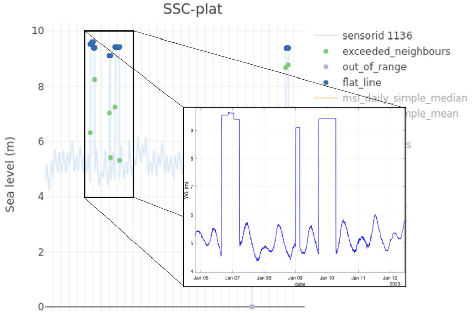

**Figure 5.** Flatline example presented through sea level data of the *ra2* sensor of the SSC-plat station for January 2023.

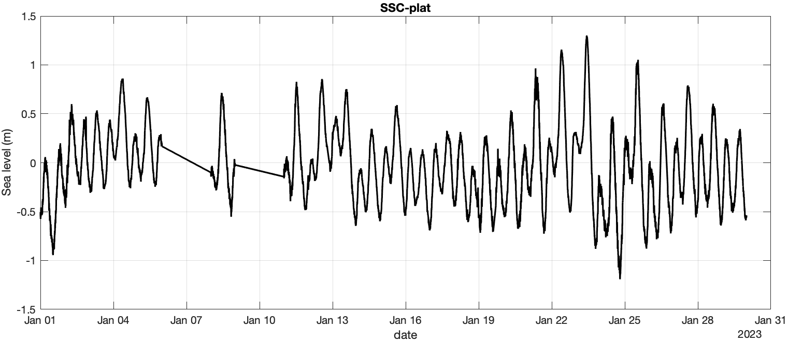

**Figure 6.** Flatline example presented through sea level data of the *ra2* sensor of the SSC-plat station for January 2023: relative sea level data after QC.

### **Out of range**

**Input data**

Function receives sea level data of chosen time period (default is previous day) plus previous moon-month or to the previous detected shift. The sea level data has high-enough distinctness and completeness, no flat lines.

**Parameters**

-   *tolerance*: (computed) to define the acceptable range of variation
    around the median.

**Calculations**

Check whether the absolute difference between the relative sea level and
median is 3 times higher than the absolute difference between the median
and the 90th quantile sea level.

**Steps**

-   *Msl* = compute median of sea level values.

-   *tolerance* = 3 \* absolute difference between 90th quantile of sea
    level data and *Msl*.

-   *Out of range* = absolute difference between sea level and *Msl* is
    higher than tolerance.

**Outputs**

-   Result = Boolean vector with out-of-range values.

-   Calculation parameters: *tolerance* = the tolerance value used for
    the out-of-range calculation.

**Example**

Example provided for the 1st pressure (*pr1*) sensor of the Gibraltar tide
gauge station (SSC-gibr) in January of year 2023 - see Fig. 7-8 and
example folder named "gibr". Multiple instances of detected out-of-range
sea level points are marked on Fig. 7 (purple dots), together with
detected exceeding neighbours (green dots) and spikes (orange dots). All
these instances are removed from the quality-controlled sea level time
series (Fig. 8).

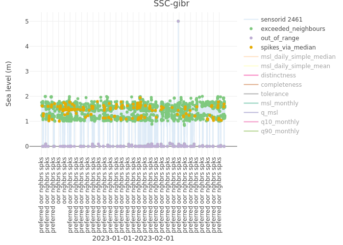
 
**Figure 7.** Out-of-range example presented through sea level data of the *pr1* sensor of the SSC-gibr station for January 2023.

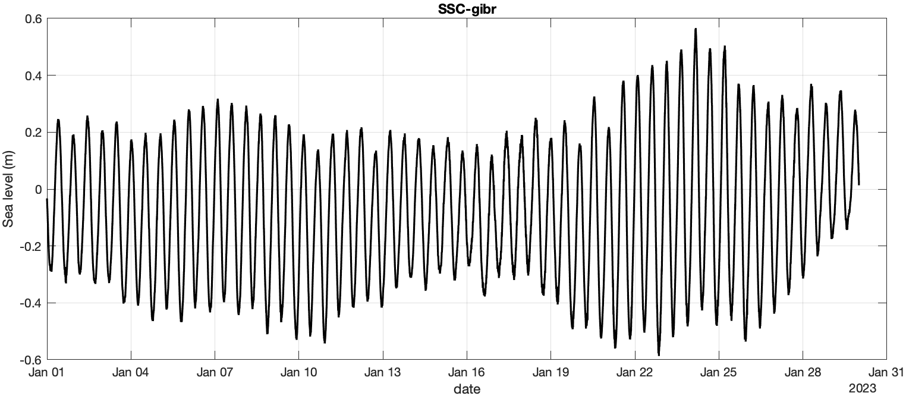

**Figure 8.** Out-of-range example presented through sea level data of the *pr1* sensor of the SSC-gibr station for January 2023: relative sea level data after QC.

### **Shift detection**

**Input data**

Function receives sea level data of chosen time period (default is previous day) plus previous moon-month or to the previous detected shift. The input sea level data has high enough distinctness, completeness, no out of range values, no exceeding neighbors and no flat lines.

-   *data\_moonmonth*: sea level data of current day + past moon-month. The mean of the current day is compared against the distribution of past moon-month. Note that the past moon-month data is cut short to the previous detected shift, if one is present within the past moon-month.

**Parameters**

-   *msl\_daily\_mean*: temporary mean sea level calculated based on values of current day.

-   *q\_msl*: percentile of the current day's mean within *data\_moonmonth*. This provides insight into the relative position of the current day's mean in comparison with the past data.

**Calculations**

Compare the MSL of the day against the 90th and 10th quantiles of sea level data for the previous moon-month or data to previous shift.

**Steps**

-   Remove current day from data_moonmonth, as only the distribution of
    the past moon-month (or data to previous shift) is needed;

-   *msl\_daily\_mean* = calculate mean of current day;

-   Obtain empirical cumulative distribution function (CDF) using the
    *ecdf* function on sea levels of *data\_moonmonth*

    -   *q\_msl* = CDF is used to get the percentile of the current day's
        mean. This indicates where the current day's mean falls within
        the distribution of the past moon-month;

    -   A shift is detected if *q\_msl* is either below 0.1 or above 0.9.

    -   The days with shift are not returned in the dataset.

    -   When the mean sea level is calculated for the levelling of data,
        the data of the last moon month will be used or until a shift
        date is reached, resulting in aligned/levelled data.

**Outputs**

-   Result = one Boolean value indicating whether a significant shift is
    detected.

-   *q\_msl*: percentile of the current day's mean within the past
    moon-month.

**Example**

Example provided for the pressure (*prt*) sensor of the DART Tonga station (SSC-dnzf) in August of year 2022 - see Fig. 9-10 and example folder named "dnzf". The clear shift in the data is detected, as indicated though the bottom labels of Fig. 9. The shift detected on the first available sea level data after the shift, namely on 11th of August, 2022, is discarded, and the sea level data from the next day on (from the 12th of August, 2022) is returned to the user (Fig. 10). Possible
shifts from the 12th of August on are based on sea level data starting from the 12th of August until the moon-month period is exceeded, or from a later day if another shift is detected within the moon-month.

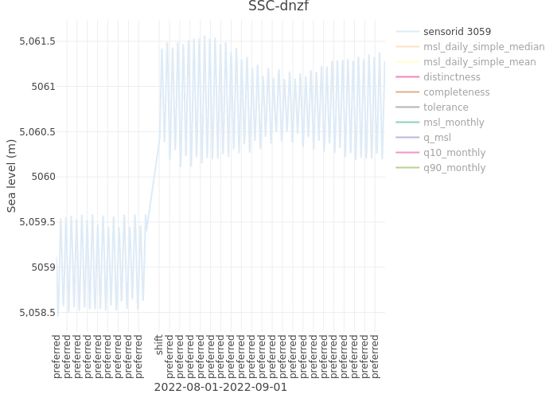
 
**Figure 9.** Shift detection example
presented through sea level data of the *prt* sensor of the SSC-dnzf DART Tonga station for August 2022; the labels at the bottom of the chart flag whether a low distinctness or shift is detected within a day, and/or the days for which the sensor is preferred compared to the other available sensors of the particular station, if any.

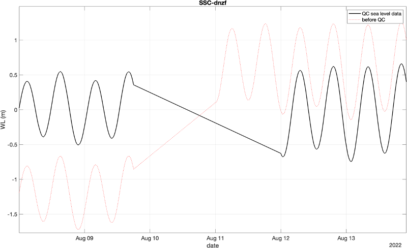
 
**Figure 10.** Shift detection example presented through sea level data of the *prt* sensor of the SSC-dnzf DART Tonga station for August 2022: zoom-in around the detected shift, showing the relative sea levels before (red-dashed lines) and after (black-continuous lines) QC.

### **Exceeding neighbours**

**Input data**

Function receives all sea level data of chosen time period (default is previous day) plus previous moon-month.

**Parameters**

-   *max\_diff\_either\_neighbour*: maximum difference either one of the neighbours can have before both points are considered as possible exceeding neighbours. Value set to 0.3 m.

-   *max\_distance\_to\_fill*: this is used to detect "blunt" spikes, meaning spikes with a flat middle part. These spikes have start and end points marked as exceeding neighbours, so they can also be captured by filling in the points in between as exceeding neighbours. This parameter sets the maximum number of points to be filled between points flagged as exceeding neighbours. Value set to 3 points.

<!-- -->

-   0: no filling

-   1: filling 1 point between exceeding neighbours, e.g., points:

    -   1 (exceeding neighbour)

    -   2 (filled as exceeding neighbour)

    -   3 (exceeding neighbour)

    <!-- -->

    -   *min\_gap\_size*: this parameter is used for the function to
        detect gaps of at least the length of *min\_gap\_size*. The start
        and endpoints of gaps are not marked as exceeding neighbours.
        Value set to 1 point.

    -   *sample\_rate*: station sample rate - also used for the function
        to detect gaps.

**Calculations**

Detects spikes by comparing the difference between neighbouring sea
level data points to *max\_diff\_either\_neighbour*. Neighbouring data
points at either end of a gap can be excluded depending on a
user-defined data gap length using the *min\_gap\_size* parameter. Blunt
spikes with a flat middle part can be detected through the
*max\_distance\_to\_fill* parameter.

The exceeding neighbours detection algorithm should not be applied for
accessing quality-controlled sea level data for tsunami events, as there
is the possibility that real data points could be flagged as exceeding
neighbours.

**Steps**

- Calculate start and end points of gaps of at least *min\_gap\_size*. Time slots were created in a previous step in relation to the sample rate of the sensor. Every time slot was given an index. After removing all empty time slots, we check if the difference between consecutive time slot indices \>= *min\_gap\_size.*
    - Get the last theoretical timeslot of the day via *sample\_rate*, and then check if it is present. If it's not, then it's marked as the start of a gap.
- Mark exceeding neighbours:
    - If sea level difference between 2 points is more than *max\_diff\_either\_neighbour*, both points are marked.
    - If no exceeding neighbours found, stop here and return gap indices.
- We iterate over all groups of exceeding neighbours, which are consecutive points marked as exceeding neighbours. We reevaluate each point:
    - In groups of 3 the middle point is selected as exceeding neighbour, while the other ones are unmarked.
    - In groups of other sizes (see Fig. 11): points outside the interval are marked as exceeding neighbours. This interval is defined as the local median of 10 points left and right from this group +/- (*max\_diff\_either\_neighbours* / 2).
- Detect blunt spikes: if 2 points are marked as exceeding neighbours and are a distance of *max\_distance\_to\_fill* points between each other, also mark the points in between. The start and end of gaps are not marked as exceeding neighbours

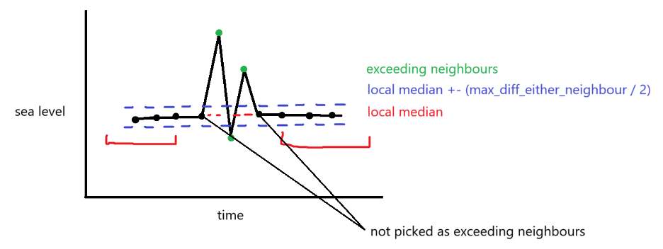

**Figure 11**. Theoretical example of a group of 5 points initially
marked as exceeding neighbours, of which 2 are ignored because they are
within a certain distance to the local median.

**Outputs**

- Result = Boolean vector with exceeding neighbours.

- *gap*: Boolean vector with gaps.

**Example**

Example provided for the pressure (*prs*) sensor of the La Libertad station (SSC-lali) in January of year 2023 - see Fig. 12-13 and example folder named "lali". Multiple instances of detected exceeding neighbours sea level points are marked on Fig. 12 (green dots), together with detected spikes (orange dots). All these instances are removed from the quality-controlled sea level time series (Fig. 13).

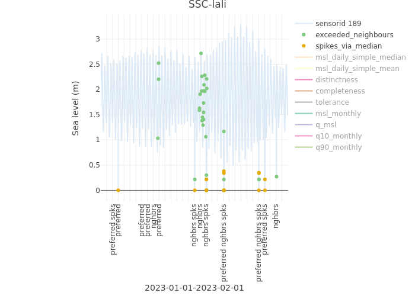

**Figure 12.** Exceeding neighbours detection example presented through sea level data of the *prs* sensor of the SSC-lali station for January 2023.

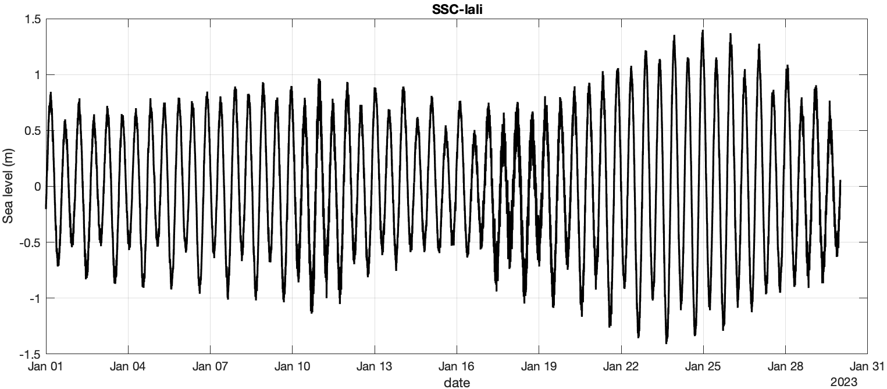

**Figure 13.** Exceeding neighbours detection example presented through sea level data of the *prs* sensor of the SSC-lali station for January 2023: relative sea level data after QC.

### **Spikes via median**

**Input data**

Function receives sea level data of chosen time period (default is previous day). The sea level data has high enough values (70), distinctness and completeness, no flat lines, no shifts, no out-of-range values and no exceeding neighbours.

**Parameters**

-   *Nwin*: number of data points (window) to fit the spline - value set to 60;

-   *ndegree*: degree of the spline (polynomial degree) - value set to 2;

-   *mthd*: method to compute fit; 1=use *polyfitNoTests.R*, 2=use R\'s *fastLm* function. Option 1 is the Williams et al. (2019) *polyfitNoTests.m* Matlab script translated to R (faster and recommended), while option 2 uses R's *fastLm* polynomial fitting function - value set to 1;

-   *NMAD*: number of scaled median absolute deviations of the data over *Nwin* points to identify an event - value set to 6;

-   *minspike*: minimum number of typical standard deviations to identify an event - value set to 3.

**Calculations**

Use a spline (2-degree polynomial) fit on given number of sea level data to detect the points that deviate significantly from the spline. This function is based on the namesake function described in the National Oceanography Centre Research & Consultancy Report (No. 64) by Williams et al. (2019) entitled "Development of an automatic tide gauge processing system". [Williams et al. (2019)](http://eprints.soton.ac.uk/id/eprint/431968) extensively modified the original Python function by Perez Gomez (2017) used in SELENE and provided by Puertos del Estado. The [spline-fitting Matlab function](https://git.noc.ac.uk/noc-tide-gauges/noc-tgqc/-/blob/75cc26198628b705ac567102da551210f7792e50/spike_detect_spline.m) of Williams et al. (2019) using the median has been translated here to R.

The deviation from the polynomial fit is measured in terms of the median absolute deviation (MAD), with points lying more than 6 scaled MAD off the spline being flagged as outliers. MAD is scaled (*scaledMAD*) by 1.4826. To eliminate false positives during quiet periods, a minimum spike size of 3 standard deviations is used, as recommended in the Williams et al. (2019) NOC report.

The spike detection algorithm should not be applied for accessing quality-controlled sea level data for tsunami events, as there is the possibility that real data points could be flagged as spikes.

**Steps**

-   Detect spikes by running the spike detection script twice, as recommended in the Williams et al. (2019) NOC report:

    -   Run the spike detection script:

        -   Fit 2-degree polynomial to *Nwin* points, centered at current point, without considering NA values.

        -   Calculate standard deviation of the data over the *Nwin* points as a measure of noise for parameter selection, without considering NA values, and scale by *minspike*.

        -   Measure absolute deviation of current point from polynomial fit and compare to *NMAD*\* *scaledMAD* and the standard deviation scaled by *minspike* to flag spikes.

        -   Run sequentially for given time-series.

    -   Remove the points flagged as spikes with NA

**Output**

-   Result = Boolean vector spline via median values.

**Example**

Example provided for the pressure (*prs*) sensor of the Dakar station (SSC-dakar) in January of year 2023 - see Fig. 14-15 and example folder named "dakar". Multiple instances of detected spikes are marked on Fig. 14 (orange dots), together with detected exceeding neighbours (green dots). All these instances are removed from the quality-controlled sea level time series (Fig. 15). It should be noted that smaller spikes are still present in the quality-controlled sea level time series, which were not detected by the spike detection algorithm (see inset of Fig. 15).

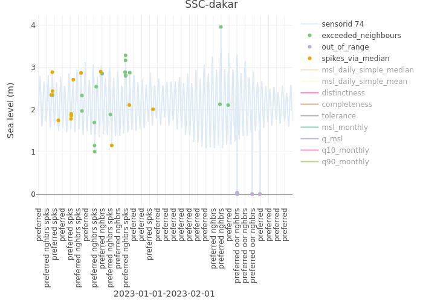

**Figure 14.**
Spike detection example presented through sea level data of the *prs* sensor of the SSC-dakar station for January 2023.

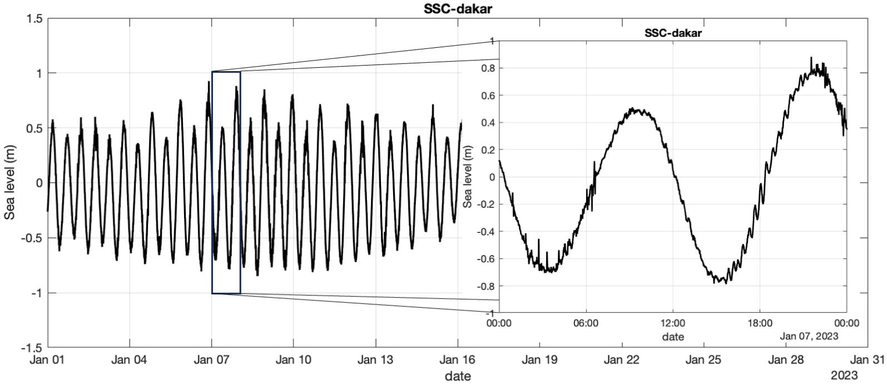

**Figure 15.** Spike detection example presented through sea level data of the *prs* sensor of the SSC-dakar station for January 2023: relative sea level data after QC.